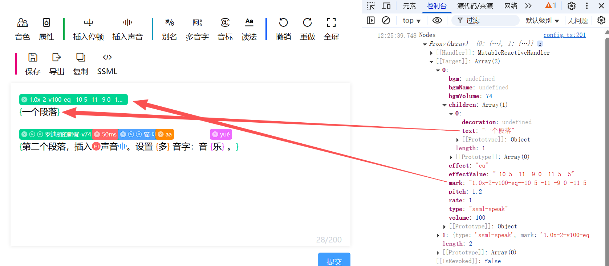

import APITable from '@site/src/components/APITable';
import ExclamationTooltip from '@site/src/components/ExclamationTooltip';
import NoWrapCell from '@site/src/components/NoWrapCell';

# 渲染节点数据

节点数据需要通过HTML结构在编辑器内容区域呈现出来，而 [模组](../../getting-started/configuration#editormodule-attributes) 的 `renderElement` 方法正是通过返回 `VNode` 从而插入到编辑器内容区域来做到呈现节点数据。

例如，属性模组通过配置 `renderElement` 方法把节点数据在编辑器内容区域渲染为如下图所示的HTML结构。属性模组的 `renderElement` 方法详情请参考 [源码](https://github.com/ssml-editor/ssml-editor/blob/master/packages/editor-vue/src/cosy-voice/module/speak/render-element.ts) 。

